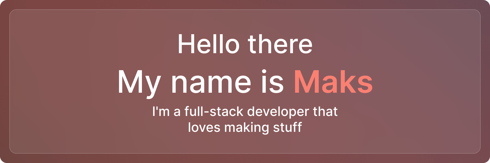

## About me

I'm Maksymilian Kasperowicz, a full-stack developer from Poland. I have a passion for building highly interactive applications, whether they're useful tools or just for fun pet projects.

Recently, I’ve been expanding my horizons with Go and Zig, enjoying recreational programming.

Outside of programming, I love reading sci-fi, dystopian, and fantasy genres. I enjoy both coffee and tea (without milk of course).

## Links

- [Personal website](https://www.maxkasperowicz.com/)
- [Ko-fi](https://ko-fi.com/yet_3)
